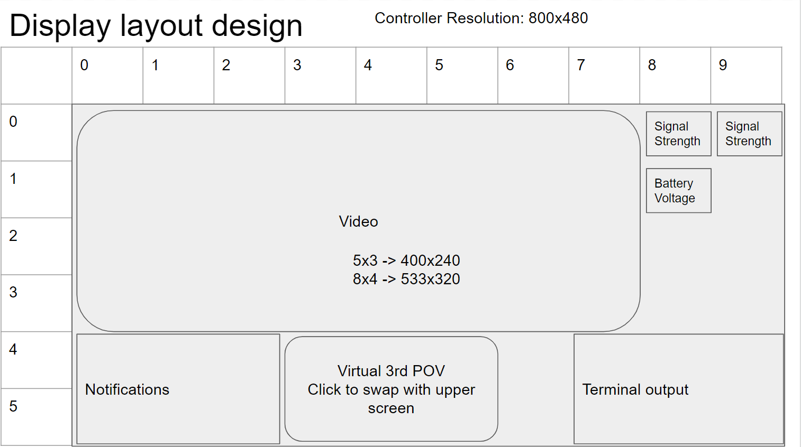
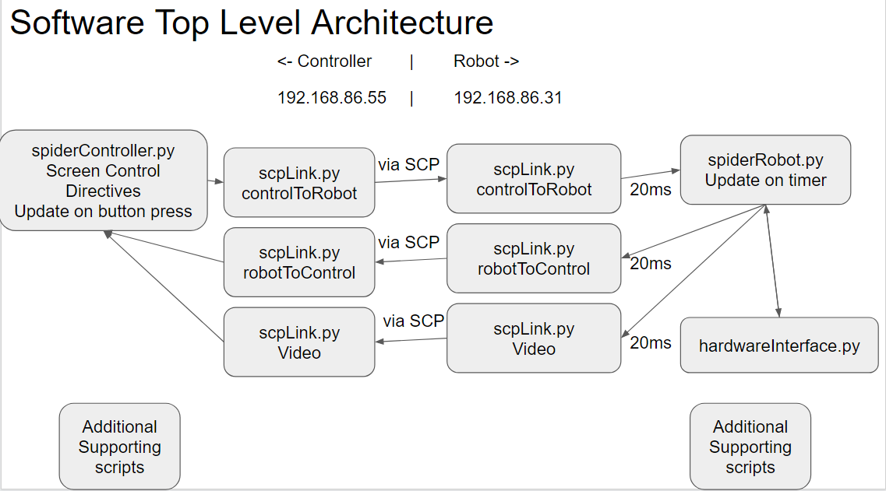

# Spider Robot 18DOF

This is my first open source project on github so constructive critism is appreciated.

## Goal:
To explore the limits and learn about writing software for a rpi controller and rpi 18 Degrees Of Freedom spider robot. As well as following engineering design processes so that people can easily collaborate and contribute to this project.

## Hardware:
Controller: Raspberry pi 3 model B with 7" official touchscreen
Robot: Raspberry pi 4 + [Hardware Platform (Not sponsored):](https://www.hiwonder.hk/collections/multi-legged-robot/products/robosoul-spiderpi-ai-intelligent-visual-hexapod-robot-powered-by-raspberry-pi)

## Setup
1. Install raspberry pi OS onto sd card for both robot and controller (the robot can use the headless OS installation)
2. pip Update/upgrade
3. Create Projects directory in home and git clone this project
4. Running setup.py should install all required libraries (I think this should work, if not then fix missing library errors)
  * I remember having to install tkinter from source instead of using pip install
5. Follow instructions in launcher.sh and launcherRobot.sh to setup running python scripts at startup.
6. Find IP address and update in scpLink.py (Should be updated so that you write to a system file instead of directly in python script)

## Documentation: (Currently Working)
Capital letters signify an acronym
### Controller
1. Controller to Wifi Receive Signal Strength Indicator and Robot to Wifi RSSI displays on controllers screen
  * This was chosen over having one device as a Wireless Access Point becuase range can be significantly increased using wireless routers/extenders at the cost of increased traffic on network although this shouldnt be an issue.
  * Updates every ? (the file that I read from updates at ?)
  * Dropout notification when no RSSI is detected for ?*2
2. 

### Robot
1. 

